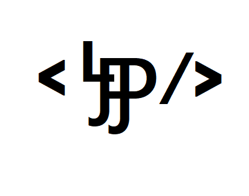
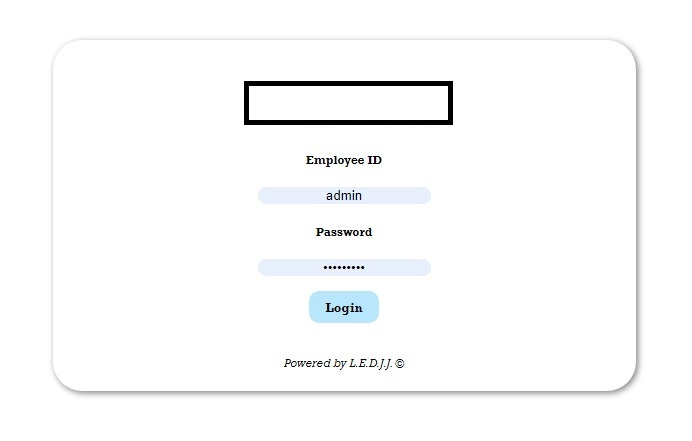
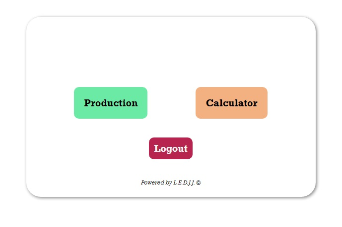
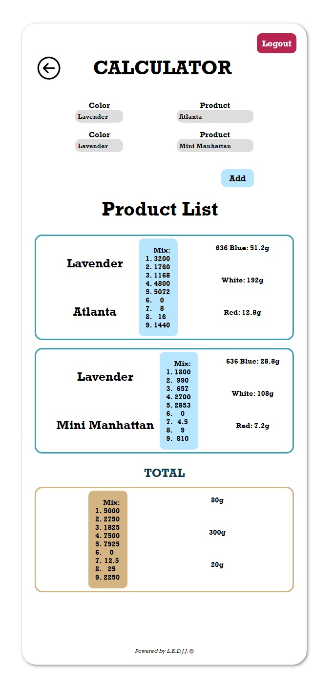
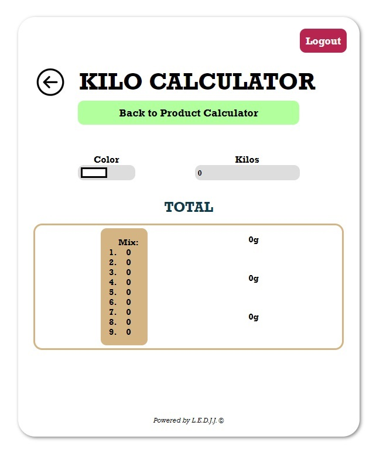
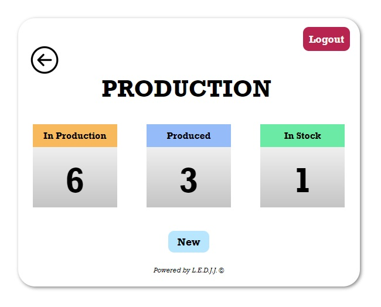
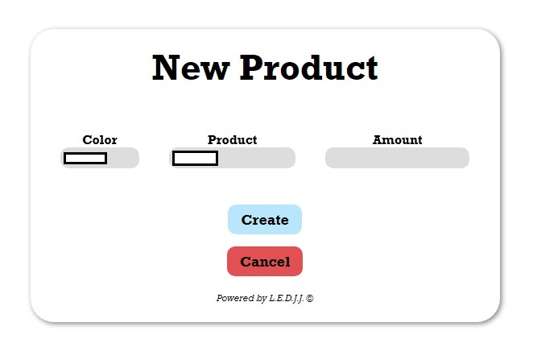
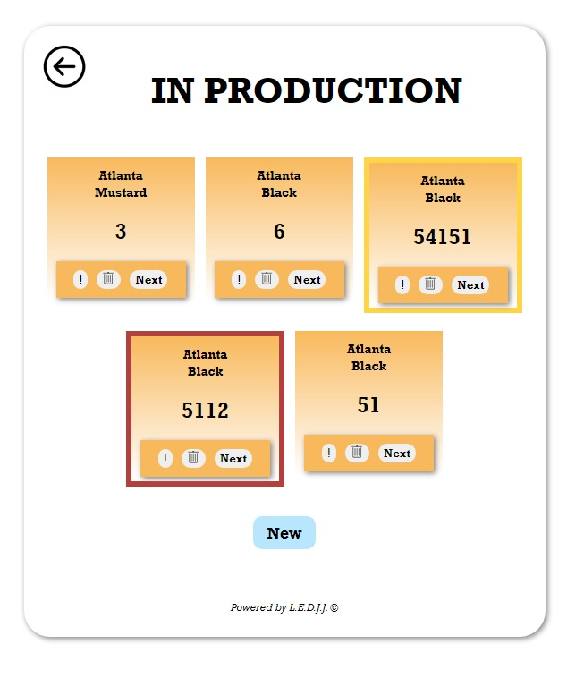
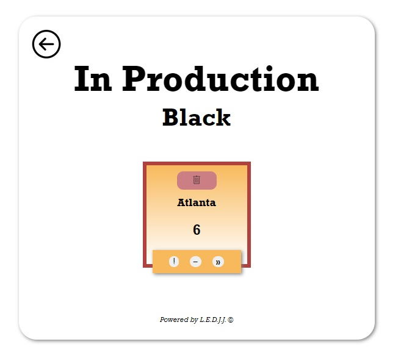

<!-- LEDJJ LOGO -->
 

  

  <h3 align="center">Production Aplication Suite</h3>

Demo Username: 'admin'

Demo Password: 'Admin2021'

  

    This project is a suite of applications for Concretti, an artisanal concrete production company.

The applications included in this suite are the following: (1)Material Calculator and (2)Production/Inventory Tracker.

Material Calculator overview:
This application is to be a product material calculator that allows the user to (1) select the color and (2)select the products to be manufactured in said color. When the user has made all of their selections,  (3) the application will display the required materials for production of those products.

Production/Inventory Tracker overview: This application is to be a production and inventory tracker. When a user engages with the application, they must be able to:
    (1) Manually enter orders by color and product.
    (2) Set priority on individual products. This process may be initated manually of automatically, depending on the following production condition:
        (a) If a particular product that is already in production is not completed in a predetermined amount of time, the status of the product becomes a priority.
    (3) See that all orders entered are given an `In Production` status.
    (4) See the status changed to `Produced` when a product tagged with `In Production` status is produced.
    (5) See the status changed to `In Stock` when a product tagged with `Produced` is moved into the shipping and packing area and packaging is completed.
     
    

    <a href='https://github.com/LFuen/ConcDemoServer'>Back End / Server Side</a>
    

  

Login Screen

Choose App

Calculator

Inventory
 

New Product
 

In Production By Color
 

Product Break Down
 

  

     
    <h3><strong>Contributors<strong><h3>
    <a href="https://github.com/jpol95"><strong>Jesse Pollack</strong></a>
     
    <a href="https://github.com/LFuen"><strong>Lili Fuentes</strong></a>
     
    <a href="https://github.com/elijahsimpsonn"><strong>Elijah Simpson</strong></a>
     
    <a href="https://github.com/Douglas4739"><strong>Douglas Ede</strong></a>
     
  

